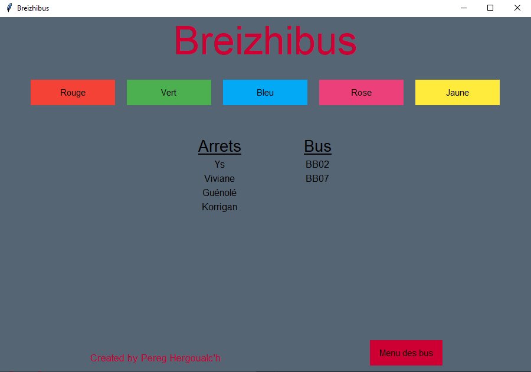

# breizhibus
## Fonctionnement de l'application
L'application est séparée en deux menus, le menu des lignes et le menu des bus.

### Menu des lignes
Le menu des lignes permet d'afficher les arrêts et les bus reliés à chaque ligne.

Chaque bouton est créé avec une boucle for, le nombre de boutons varie en fonction du nombre de lignes en base. Chaque bouton est relié à un id de ligne grace à la fonction ```partial``` du module ```functools```. À chaque affichage la frame est vidée entièrement afin d'afficher les nouvelles informations correspondantes.



### Menu des bus
Le menu des bus permet de visionner tous les bus présents en base, de les supprimer, les modifier et les ajouter.

Chaque bus en base est affiché avec son numéro, son immatriculation, son nombre de places et sa ligne.
- Pour supprimer un bus, il suffit de choisir un bus dans la première Combobox et d'appuyer sur supprimer, le menu va se réactualiser sans le bus supprimé.
- Pour ajouter un bus il faut remplir tous les champs, ```Combobox``` et ```Entry``` avec les informations voulues et cliquer sur le bouton ```Ajouter/Modifier```. Il faut respecter l'ordre de l'affichage au dessus. Si un format d'une entrée est incorrect, une fenetre va s'afficher avec l'erreur.
- Pour modifier un bus, il faut dans un premier temps séléctionner un bus dans la première Combobox, cela va remplir les champs des informations. Il faut alors modifier les informations voulu et cliquer sur le bouton ```Ajouter/Modifier```.


## Choix techniques

Pour l'interface j'ai utilisé ```Tkinter``` utilisé en objet.
J'ai séparé le code en plusieurs méthodes pour pouvoir les assigner à mes différents boutons. Chaque bouton à sa méthode.

Pour la connexion à la base de données j'ai utilisé ```*mysql connector```.

Pour la base de données, j'ai créé 4 tables:
- bus
- lignes
- arrets
- arrets_lignes


## Difficultées 

J'ai eu un problème avec les boutons pour afficher les différentes lignes. Ils affichaient tous les infos de la même ligne. J'ai trouvé la fonction **partial** qui règle ce problème en stockant une méthode et un argument dans une variable.
